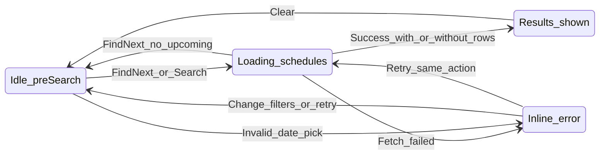

# Flow Core — Session discovery (activity + find / date search)

Baseline behavior on the sessions view before build-specific flows (H, G, F). Maps current prototype intent; update when multi-day or rink filter lands.

## Summary

User chooses **Public skate** or **Stick & puck**, then either **Find next session** (single upcoming day today) or **Search by date** (one selected day). Results show session accordions; **Clear** resets results.

## Entry & preconditions

| Precondition | If false |
| --- | --- |
| `rinks.json` loaded | Full-page load error |
| `sessions.generated.json` loaded (may be empty) | Date picker may error on pick; find-next may fail fetch |
| User location = region anchor (03820) or geolocation later | Distance sort/filter uses anchor |
| Activity tab selected | Default: Public skate |

## States

## Happy path — Find next session (current)

1. User confirms activity tab.
2. User taps **Find next session**.
3. UI: CTA **Searching…**, disabled; results region `aria-busy`.
4. App fetches fresh `sessions.generated.json`.
5. App finds earliest upcoming session matching activity, radius, and rink set.
6. Results region shows one **day header** + session list (or empty for that day).
7. User expands a session → detail, share, official link.

## Happy path — Search by date (current)

1. User taps **Search by date** → panel opens (date input, Search, Clear).
2. User picks a date with schedule data for current activity.
3. User taps **Search**.
4. Same loading → results as find-next for that single day.

## Alternate paths

| Path | Trigger | Behavior |
| --- | --- | --- |
| Switch activity | User changes tab | Close overlays; clear applied results; if draft date invalid for new activity → inline error |
| Expand other session | Second card tap | Previous accordion closes (one open) |
| Share | Web Share or clipboard | Notice 3s; no navigation |
| Programs | Header **Programs** | Swap main column (see Flow I) |

## Empty states

| State | UI | Recovery |
| --- | --- | --- |
| Pre-search | “Use Find next session or Search by date.” | Tap either CTA |
| Search returned 0 rows | “No sessions for this day and filter.” + muted hint | Change date, activity, or (future) rinks |
| Find next: no upcoming | Inline error, no day header | Try other activity; Search by date; widen rinks (future) |

## Error & recovery

| Trigger | User sees | Recovery action |
| --- | --- | --- |
| Rinks fetch failed | “Could not load rink data.” | Reload page |
| Sessions fetch failed on search/find | “Could not load schedules. Try again.” | Tap action again |
| Date picked with no data for activity | “No schedule data for this date for {activity}…” | Pick another day or Find next |
| Sessions not loaded yet on date pick | “Schedules aren’t loaded yet…” | Wait; pick date again |
| Today’s sessions all ended | Filter hides ended (30 min grace) | Empty list for today → try tomorrow or Find next |

## Copy inventory

| Element | Copy |
| --- | --- |
| Pre-search empty | Use Find next session or Search by date. |
| Loading | Searching schedules… |
| Clear (with results) | Clear |
| Trust | Confirm with rink; official link in detail |

## Acceptance criteria

- [ ] Activity change clears results and does not auto-run search.
- [ ] Loading disables primary CTAs and sets `aria-busy` on results.
- [ ] Clear returns to pre-search without losing activity tab.
- [ ] Every result row traceable to rink id + source URL in detail.
- [ ] No horizontal scroll at 320px on controls + results.

## Dependencies

- Flow **H** changes date panel defaults and Search/Clear layout.
- Flow **G** narrows rink set for steps 5–6.
- Flow **F** replaces single-day find-next results with five-day window.
