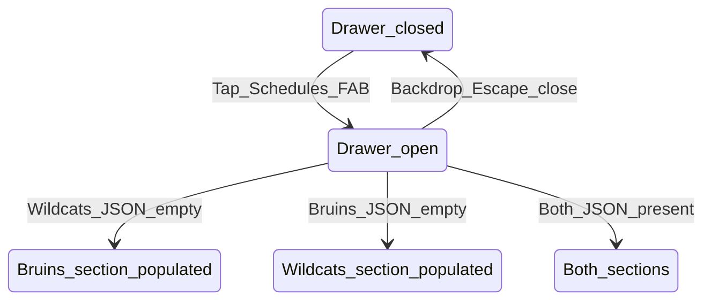

# Flow E — Schedules companion (Bruins + UNH Wildcats)

**Feedback:** “It would be nice to see the wildcats schedule too.”  
**Priority:** P2 · **Persona:** Chris (primary)

## Summary

Bottom **Schedules** FAB opens a drawer with a **Wildcats | Bruins** toggle; one team’s games shown at a time (not stacked scroll). **Hype** lives in the drawer footer.

## Entry & preconditions

| Precondition | If false |
| --- | --- |
| At least one of `bruins-schedule.json`, `wildcats-schedule.json` has games | Hide Schedules FAB entirely |
| User on any main view | Schedules FAB visible (sessions or programs) |

## States

## Happy path

1. User taps **Schedules** FAB (bottom-right; shell padding clears FAB).
2. Drawer opens; scroll locked on body.
3. If both teams have data: **Bruins | Wildcats** text tabs (muted inactive, ink active); default **Bruins** when opening.
4. Active tab shows that team’s games by month (TV line for Bruins when present); past games muted.
5. User taps **Official … schedule** footer for the active team.
6. User closes drawer → returns to prior view.

## Alternate paths

| Path | Behavior |
| --- | --- |
| Open My rinks while drawer open | Not allowed — open drawer closes others first |
| Only Bruins data | Wildcats section shows “Schedule unavailable” + UNH official link |
| Only Wildcats data | Bruins section omitted or same unavailable pattern |

## Empty states

| State | UI |
| --- | --- |
| Section JSON empty after failed scrape | Muted: Schedule unavailable. Check official site. + link |
| Entire companion empty | No Schedules FAB |
| No Bruins/UNH game today or tomorrow (ET) | No game-day banner |
| Game today or tomorrow | Compact left-aligned pill above session controls (not tappable) |

## Error & recovery

| Trigger | User sees | Recovery |
| --- | --- | --- |
| Bruins API fail (scrape) | Last good JSON retained | User may not notice; Updated not shown for companion optionally |
| Wildcats fetch fail | Empty section + link | Open official UNH schedule |
| Drawer open, rotate device | Drawer remains; scroll restored on close | Close and reopen |
| User expects rink sessions | Companion is separate from session search | Drawer title **Game schedules** only; no lede copy |

## Copy inventory

| Element | Copy |
| --- | --- |
| Schedules FAB | Schedules |
| Drawer Hype | Hype |
| Bruins title | Bruins {season_label} |
| Wildcats title | UNH Wildcats men's hockey |
| Disclaimer (each) | Not affiliated with {league/team}. |
| Footer link | Official schedule |

## Acceptance criteria

- [ ] One Schedules FAB, one drawer; Hype in drawer footer.
- [ ] FAB hidden when both JSON game arrays empty.
- [ ] Escape, backdrop, × close drawer; scroll unlock.
- [ ] No NHL/UNH logos in UI (palette only).
- [ ] Scraper retains last-good file per league on failure.

## Dependencies

- `wildcats-schedule.mjs` + data file
- Refactor Bruins-only UI in `App.tsx` to shared drawer
- `scraping-policy.md` + `data-model.md` updates
