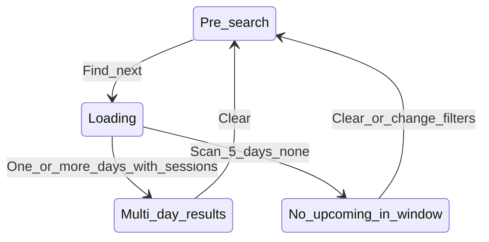

# Flow F — Find Ice (five-day window)

**Feedback:** “I want to see more than just one result” (next available).  
**Priority:** P1 · **Personas:** Chris, Jordan

## Summary

**Find Ice** loads upcoming sessions across **five calendar days** starting from the first day with any matching session (respecting activity, radius, and rink filter). Each day with sessions gets a day header and list; days with zero sessions are skipped within the scan window.

## Entry & preconditions

| Precondition | If false |
| --- | --- |
| Same as Flow Core | Block or error per Core |
| ≥1 rink selected (Flow G) | Inline block message |

## States

## Happy path

1. User selects activity (Public skate or Stick & puck).
2. User taps **Find Ice**.
3. App fetches sessions; computes `startDate` = first calendar day ≥ today with ≥1 qualifying session.
4. App collects sessions on `startDate` … `startDate+4` (five days total calendar span from startDate).
5. Results region renders **one header block per day** that has sessions (reuse `results-day-header` + list).
6. User expands sessions, shares, opens maps as today.
7. User taps **Clear** → pre-search prompt; multi-day state cleared.

## Alternate paths

| Path | Behavior |
| --- | --- |
| Only 1 day has sessions in window | Still valid; user sees one header (better than today but may prompt “expand window” later) |
| Sessions only on day 5 | User scrolls past earlier headers |
| Mix of instructional + rec | All shown; badges distinguish |
| User then uses Search by date | Clears multi-day mode; single-day results |

## Empty states

| State | UI | Recovery |
| --- | --- | --- |
| No sessions in 5-day scan | “No upcoming {activity} in the next five days for your rinks.” | Change activity; My rinks; Search by date on known good day |
| Partial days empty | Omit empty day headers (no “No sessions” stub per day) | — |

## Error & recovery

| Trigger | User sees | Recovery |
| --- | --- | --- |
| Fetch failure | Could not load schedules. Try again. | Retry Find Ice |
| All sessions today ended | startDate rolls to tomorrow automatically | — |
| Rink scrape stale | Fewer rows; **Updated** timestamp in header | Official link in card |
| User clears mid-scroll | Returns to idle | Find Ice again |

## Copy inventory

| Element | Copy |
| --- | --- |
| CTA (keep v1) | Find Ice |
| Empty (proposed) | No upcoming {activity} in the next five days for your rinks. |
| Day kicker | {Activity} · Today / Tomorrow / In N days (existing helper) |

## Acceptance criteria

- [ ] At least two days of results when data exists on multiple days within window.
- [ ] Sessions sorted by start time within each day.
- [ ] Clear resets `appliedDate` / multi-day range completely.
- [ ] Rink filter (G) respected.
- [ ] `aria-live` announces result count change after load.

## Dependencies

- **G** rink selection
- **H** Clear behavior consistent across modes
- Utils: `findNextSessionDays` or equivalent (replace single `findNextSession` for this CTA only)
