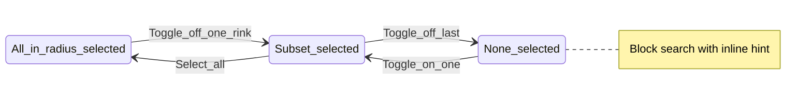

# Flow G — Choose rinks (filter search area)

**Feedback:** “I want to just search the Dover Ice Arena.”  
**Priority:** P1 · **Personas:** Jordan (primary), Chris

## Summary

**My rinks** drawer becomes **choose which rinks count** for session search, find-next, and programs — still bounded by geographic radius, not a nationwide search.

## Entry & preconditions

| Precondition | If false |
| --- | --- |
| `rinks.json` loaded | Drawer hidden |
| At least one pilot/active rink in radius | Empty drawer list → explain radius |

## States

## Happy path

1. User taps **My rinks** in header.
2. Drawer title **My rinks**; lede **Choose rinks for search** (short).
3. List shows rinks in radius (nearest first) with toggle **Include in search** (default ON for all).
4. User turns off all but **Dover Ice Arena**.
5. User closes drawer (backdrop, ×, Escape).
6. User runs **Find next** or **Search by date** → only Dover sessions appear.
7. **Programs** view lists programs for selected rinks only.
8. Selection persists in `sessionStorage` for return visit.

## Alternate paths

| Path | Behavior |
| --- | --- |
| **Select all** / **Clear all** quick actions | Optional footer links; Select all = all in radius ON |
| User excludes all rinks | Search/find-next blocked with inline message in controls area |
| Paused rinks | Still “coming soon” footnote only — not toggles |
| User changes location later (future geolocation) | Recompute radius list; merge toggles by rink id |

## Empty states

| State | UI | Recovery |
| --- | --- | --- |
| No rinks in radius | “No rinks within {radius} km.” | Future: widen radius |
| Programs with 0 selected rinks | Same as today but copy mentions toggles | Open My rinks |

## Error & recovery

| Trigger | User sees | Recovery |
| --- | --- | --- |
| `sessionStorage` blocked | Selection lasts session only | No error toast; optional muted note |
| Stale rink id in storage | Ignore unknown ids | Fall back to all-in-radius ON |
| Search with 0 rinks selected | “Turn on at least one rink in My rinks.” | Open drawer |
| Selected rink scrape failed | Session list empty; health badge **Scrape issue** on row | Pick another rink or confirm on rink site |

## Copy inventory

| Element | Copy |
| --- | --- |
| Header button | My rinks |
| Drawer lede | Choose rinks for search. |
| Toggle aria | Include {rink name} in search |
| Block search | Turn on at least one rink in My rinks. |
| Programs empty (refined) | No programs for your selected rinks. |

## Acceptance criteria

- [ ] Toggling Dover off removes Dover from find-next, date search, and programs.
- [ ] Default first visit: all in-radius rinks ON.
- [ ] Persistence survives refresh when storage available.
- [ ] Header can show count e.g. **My rinks · 3** → **My rinks · 1** when one selected (optional).
- [ ] Drawer still closes other overlays on open.

## Dependencies

- Flow **Core**, **F**, **H** all use shared `selectedRinkIds` (or equivalent).
- Flow **I** programs filter uses same set.
