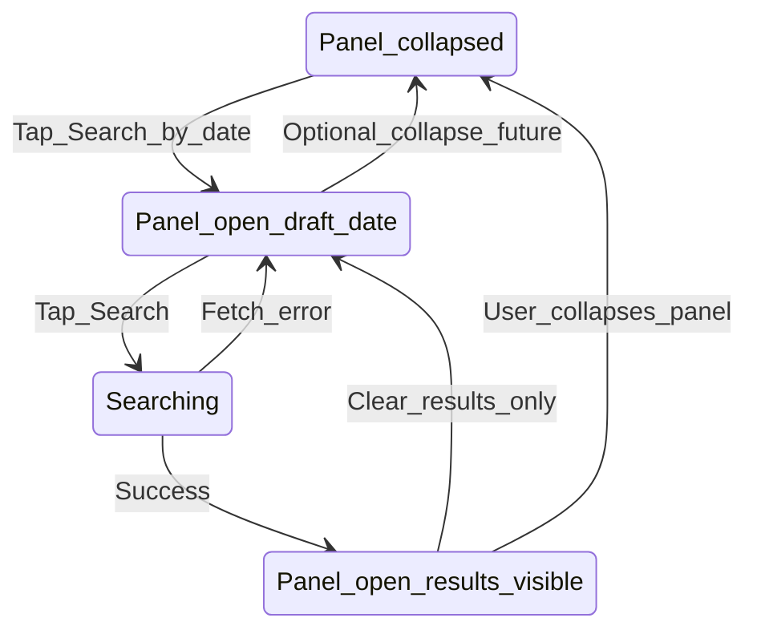

# Flow H — Search by date (mobile-safe)

Fixes tester-reported **overlay / layout** issues and **empty date default** when opening the date panel.

**Priority:** P0 · **Personas:** Jordan (primary), Chris

## Summary

Progressive disclosure opens a date row with a **pre-filled valid date**, stacked **Search** and **Clear** controls on narrow viewports, and predictable enable/disable rules so users are never stuck with a blank date and a confusing Search button.

## Entry & preconditions

| Precondition | If false |
| --- | --- |
| User on sessions view | N/A |
| `scheduleCoverage` computed for current activity | Disable date input min/max; show load wait copy on open |
| No other overlay open | Opening date panel closes My rinks + Schedules |

## States

## Happy path

1. User taps **Search by date** (calendar icon).
2. Panel expands; **Date** field is **not empty**:
   - If today ∈ coverage → default **today**.
   - Else → first available date in coverage (min date).
3. User adjusts date if needed (native picker); invalid gap days rejected inline.
4. User taps **Search** (full width on mobile).
5. Loading → results for that day (see Flow Core).
6. **Clear** clears **results only**; panel stays open; date field keeps last draft value (or resets to default per product choice — **prefer keep draft**).

## Alternate paths

| Path | Behavior |
| --- | --- |
| User opens panel then switches activity | Panel closes (global rule); reopening recomputes min/max/default |
| User has results, changes date in input | Does not auto-search; must tap Search again |
| User taps Find Ice while panel open | Panel may stay closed (find-next does not expand panel — unchanged) |

## Empty states

| State | UI |
| --- | --- |
| No coverage at all for activity | On open: inline error + disable Search; suggest other activity |
| Search → 0 sessions | Standard results empty (Flow Core) |

## Error & recovery

| Trigger | User sees | Recovery |
| --- | --- | --- |
| Empty date (regression guard) | Search **disabled**; helper “Pick a date.” | Auto-default on open prevents this |
| Date with no scraped data | Inline error on pick; date cleared or reverted | Pick in-range date |
| Fetch failure on Search | “Could not load schedules. Try again.” | Tap Search again |
| Search button overlapped (bug) | — | **Fix:** `search-row` stacks: date 100% width; Search + Clear each `width: 100%` below `640px`; min touch 48px |
| Search disabled after success with rows | Confusing on mobile | **Fix:** allow re-Search same or new date OR only disable when `isSearching`; document in ui-patterns |
| Panel open under sticky header | Controls clipped | Verify z-index; no duplicate fixed layers |

## Copy inventory

| Element | Copy |
| --- | --- |
| Trigger | Search by date |
| Label | Date |
| Search idle | Search |
| Search busy | Searching… |
| Clear (panel) | Clear |
| Helper (no date — guard) | Pick a date to search. |

## Acceptance criteria

- [ ] At 320px and 390px, date input and buttons do not overlap Find Ice or each other.
- [ ] Opening panel never shows `type="date"` with empty value while Search looks enabled.
- [ ] Search works after Clear without forcing user to re-open panel.
- [ ] Only one overlay at a time (rinks / schedules / date panel policy documented).
- [ ] Feedback log entry for mobile glitch marked **done** with device widths tested.

## Dependencies

- Flow **G**: rink filter applies to Search results same as find-next.
- Flow **F**: Clear must reset multi-day mode when that ships.
