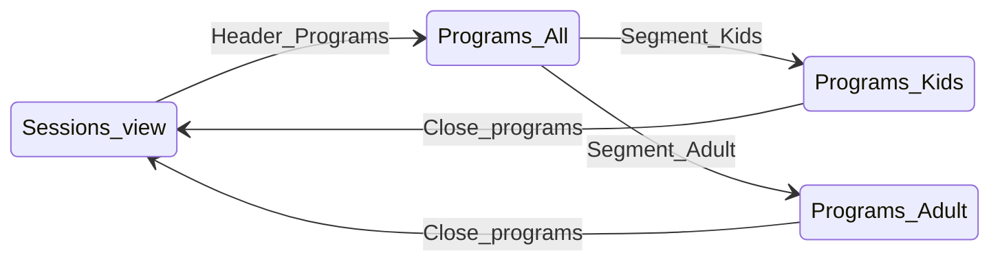

# Flow I — Programs (Kids / Adult / All)

**Feedback:** “Where are the kids programs?”  
**Priority:** P1 · **Personas:** Jordan (primary), Chris

## Summary

Programs view surfaces **multi-week arena programs** with an **audience filter** so youth content is discoverable. Session tabs remain for **drop-in ice** (public skate, stick); programs hold leagues, learn-to-skate, camps with registration copy.

## Entry & preconditions

| Precondition | If false |
| --- | --- |
| `programs.json` has ≥1 program OR youth stub policy | Hide **Programs** nav |
| Rink filter (G) | Programs filtered to selected rinks |

## States

## Happy path — Jordan finds kids programs

1. User taps **Programs** in header.
2. Lede mentions **kids and adult** programs; confirm with arena.
3. User taps segment **Kids**.
4. List shows programs with `audience: youth` or `family` for selected rinks.
5. User expands card → offerings, registration, phone, official links.
6. User taps × → returns to sessions view.

## Happy path — Chris finds adult league

1. Programs → segment **Adult** (default can be **All** or **Adult** — prefer **All** first visit).
2. Sees co-ed league, Chix with Stix, etc.
3. Opens official registration link.

## Alternate paths

| Path | Behavior |
| --- | --- |
| Cross-link from Public skate empty | “Looking for classes? Try Programs → Kids.” |
| Youth stick on Stick tab | Still session rows — not duplicated as program unless curated |
| Share (future) | Out of scope this flow |

## Empty states

| State | UI | Recovery |
| --- | --- | --- |
| Kids filter, no youth rows | No kids programs for your selected rinks. Try Public skate or Stick & puck for open ice times. | Change rinks; other segment |
| Adult filter empty | No adult programs for your selected rinks. | My rinks |
| All empty | No programs for your selected rinks. | My rinks |

## Error & recovery

| Trigger | User sees | Recovery |
| --- | --- | --- |
| `programs.json` fetch fail | Programs nav hidden or sessions error banner | Reload |
| Program missing `audience` | Treated as **adult** in filter (migration default) | Data fix |
| Registration closed / TBD in JSON | Static copy in offering | User calls rink |
| Wrong times vs sessions | Disclaimer: programs are editorial; sessions are scraped | Official links |

## Data rules

| Field | Values | UI |
| --- | --- | --- |
| `audience` | `youth`, `adult`, `family` | Kids = youth + family; Adult = adult + family optional policy — **Kids = youth only; Family shows in All + Kids** |

Add at least one Dover **youth** program entry (learn-to-skate / hockey school) with source URL.

## Copy inventory

| Element | Copy |
| --- | --- |
| Lede (new) | Leagues, learn-to-skate, and drop-ins from your selected rinks. Confirm times and registration with the arena. |
| Segment labels | Kids · Adult · All |
| Footer | Not affiliated… Official program listings |
| Empty kids | No kids programs for your selected rinks. Try Public skate or Stick & puck for open ice times. |

## Acceptance criteria

- [ ] Jordan can reach youth content in ≤2 taps from home (Programs → Kids).
- [ ] Adult-only JSON still appears under Adult and All.
- [ ] Programs respect rink toggles from Flow G.
- [ ] `data-model.md` documents `audience`.
- [ ] PRD non-goal clarified: discovery + links, not enrollment in-app.

## Dependencies

- Flow **G**
- Content edit to `programs.json`
- Persona doc update (Jordan)
